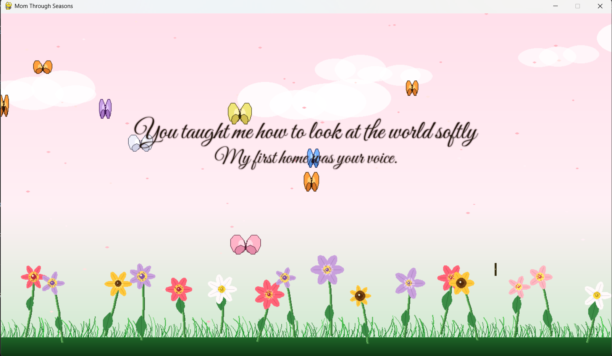
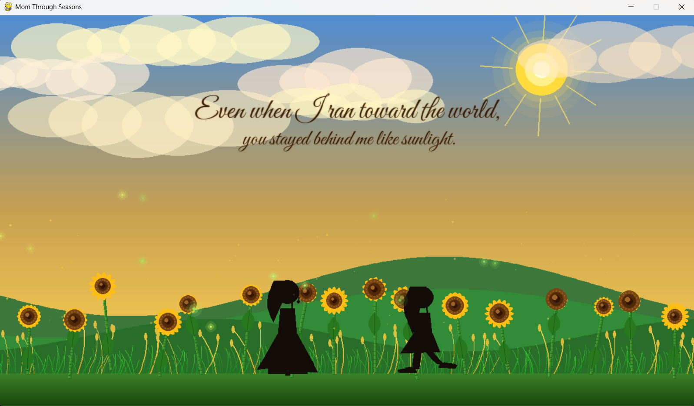
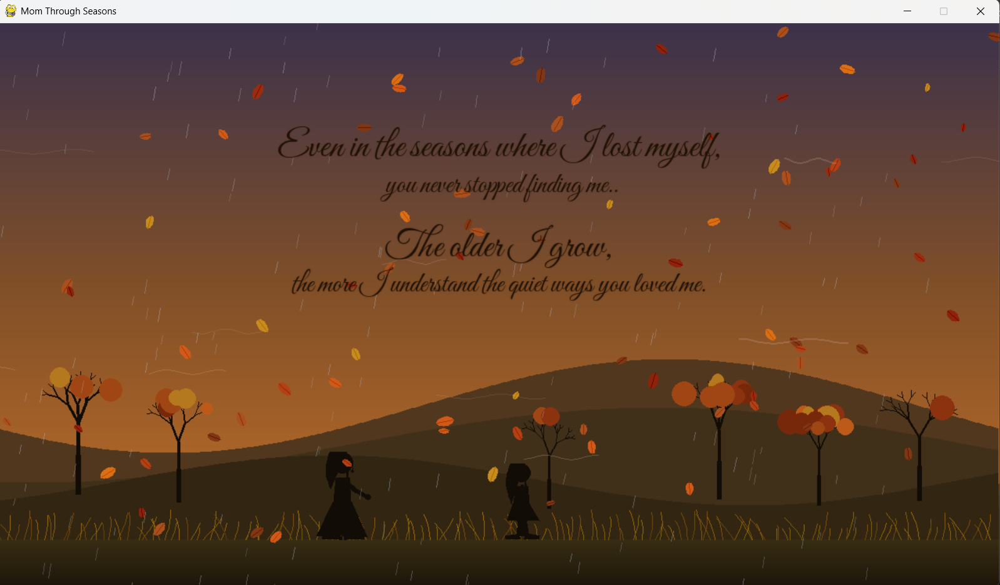
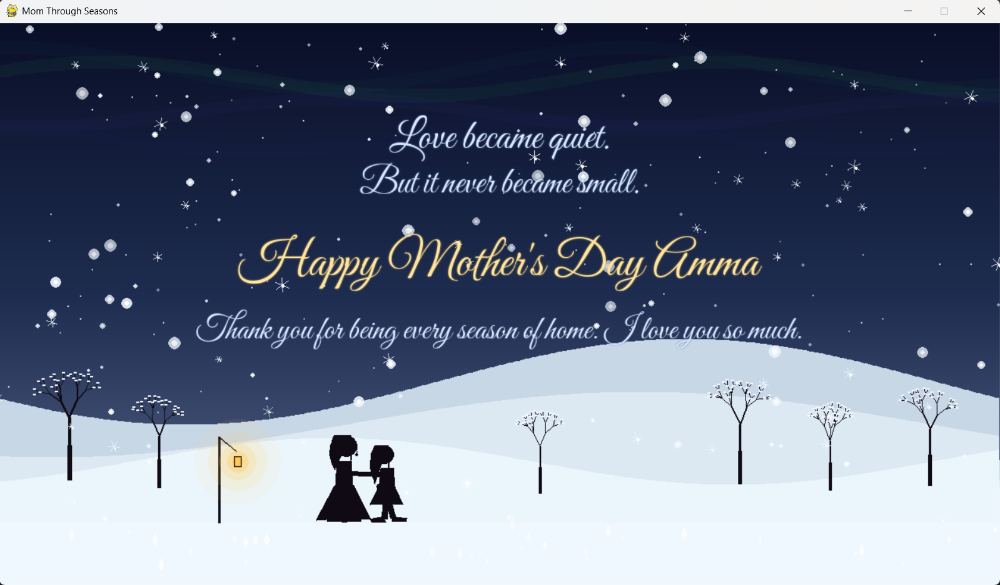

# mom-through-seasons-using-ai-prompt-engineering
AI-assisted cinematic software experience.

A visual journey through Spring, Summer, Autumn, and Winter —
exploring memory, distance, growth, and quiet gratitude.

## Concept

This project explores emotional storytelling through atmospheric visual design, procedural animation, and AI-assisted software generation.

Each season represents a different emotional phase of a mother-daughter relationship:

- Spring → innocence
- Summer → growth
- Autumn → emotional distance
- Winter → reconciliation and gratitude

## AI-Assisted Development
The project was developed through iterative prompt engineering and modular AI collaboration.

Rather than generating the application in a single step, each scene, particle system, visual effect, and emotional transition was developed incrementally through structured prompting, refinement, and integration.

The workflow focused heavily on:
- cinematic atmosphere
- emotional pacing
- modular scene architecture
- visual continuity
- iterative creative direction

##Here are the preview images of the developed game

### Spring

### Summer

### Autumn

### Winter

## Tech Stack

- Python
- Pygame
- Procedural animation
- Particle systems
- Gradient rendering
- AI-assisted code generation

## Features

- Dynamic seasonal transitions
- Atmospheric particle systems
- Procedural snowfall, rain, leaves, petals
- Cinematic silhouette animation
- Aurora rendering
- Layered parallax landscapes
- Emotional typography sequences
- Continuous ambient soundtrack support

## Run
To run the project just use the following steps:

pip install pygame
python main.py

Or you can download the executable file uploaded.
